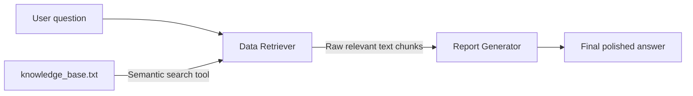

# BBL Simple Agent

A Hotel Californian question-answering application built with LangChain and
LangGraph. It uses retrieval-augmented generation (RAG) to search a local text
knowledge base, `knowledge_base.txt`, and generate answers grounded in the
retrieved information.

## Agent definitions

### Data Retriever

- **Role/Instructions:** Expert in information retrieval, tasked with finding
  all snippets in `knowledge_base.txt` relevant to the user's request. It
  retrieves information without answering the question directly.
- **Tool:** The custom Python tool `retrieve_hotel_data` reads the knowledge
  base through the document loader and performs semantic search. The agent is
  configured to use this tool, then `transfer_to_report_generator` for handoff.
- **Output:** Raw, relevant text chunks passed to the Report Generator.

### Report Generator

- **Role/Instructions:** Expert writer and synthesizer. Uses the supplied
  snippets to produce a comprehensive, accurate, non-redundant, and
  well-formatted answer to the user's query.
- **Tool:** No additional tools; this agent is configured with `tools=[]`.
- **Output:** The final, polished answer presented to the user.

## How it works

The agents follow a sequential workflow: the Data Retriever's output is passed
as input to the Report Generator, together with the original user's question.



1. The **Data Retriever** is prompted to create a semantic search query, call
   `retrieve_hotel_data` once, and hand off the retrieved context.
2. The retrieval tool loads and splits the knowledge base, embeds the chunks
   with a local Hugging Face model, and searches an in-memory vector store.
   It returns up to `RAG_TOP_K` matching chunks (five by default).
3. The **Report Generator** is instructed to answer using the retrieved context,
   acknowledge missing information, and decline unrelated questions.

The retriever is built on its first use and cached for the lifetime of the
process. The vector index is not persisted to disk.

### Passing data between agents

This project passes retrieved text through a dedicated field in the shared
graph **state**. The retrieval result first appears as a tool message in the
Data Retriever's message history. During handoff,
`transfer_to_report_generator` copies that text into
`ContextAgentState.retrieved_context` using a `Command` update. The Report
Generator reads this field and the latest user question to build its prompt.

The snippets could also be passed through the shared `messages` history.
That approach would require the handoff to forward the retrieval messages and
the Report Generator to read them.

## Requirements

- Python 3.11 or newer, as declared in `pyproject.toml`.
- `uv` for dependency management and running commands.
- A chat model that supports tool calling, with credentials required by its provider.
- Internet access for dependency installation, chat requests, and the initial
  embedding-model download.

## Setup

Run commands from the repository root.

Install the project dependencies, including the LangGraph CLI:

```shell
uv sync
```

Create or update `.env` in the repository root. Set `CHAT_MODEL` to your chosen
model in `provider:model` format and add the credentials required by that
provider. For example, to use an OpenAI model:

```dotenv
OPENAI_API_KEY=your_openai_api_key
CHAT_MODEL=openai:gpt-5-nano-2025-08-07
```

For another provider, install its LangChain integration package and set its
API key or other required credentials in `.env` using that provider's
environment variable names.

The application loads `.env` through `python-dotenv`. The local LangGraph server
also references it in `langgraph.json`. `.env` is ignored by Git.

To enable LangSmith tracing, set `LANGSMITH_TRACING=true` and configure
`LANGSMITH_API_KEY` and `LANGSMITH_PROJECT` in `.env`.

## Run a question

```shell
uv run bbl-simple-agent "Is there a picnic area at hotel californian?"
```

The command prints the final response. If no query is supplied, it uses
"Is there a picnic area at hotel californian?" by default.

The first retrieval may take longer while the embedding model downloads and the
in-memory index is created.

## Run the local LangGraph server

```shell
uv run langgraph dev
```

`langgraph.json` exposes the graph as `bbl_simple_agent`, loading
`bbl_simple_agent.agent:graph`. Use the URLs printed by the server to access the
local API and development interface.

## Example results

The `scenario_*_label.txt` files contain expected reference content used to
check the answers. The screenshots show the generated output for each query.

| Query | Expected reference | Output screenshot |
| --- | --- | --- |
| Do the rooms at Hotel Californian have a sea view? | [Scenario 1 label](artifacts/scenario/scenario_1_label.txt) | [Chat output](artifacts/scenario/scenario_1_langsmith_chat.PNG) |
| How close to the beach is Hotel Californian? | [Scenario 2 label](artifacts/scenario/scenario_2_label.txt) | [Chat output](artifacts/scenario/scenario_2_langsmith_chat.PNG) |
| Does Hotel Californian have a lobby? | [Scenario 3 label](artifacts/scenario/scenario_3_label.txt) | [Terminal output](artifacts/scenario/scenario_3_terminal.PNG) |
| Is there a picnic area at Hotel Californian? | [Scenario 4 label](artifacts/scenario/scenario_4_label.txt) | [Terminal output](artifacts/scenario/scenario_4_terminal.PNG) |

## Configuration

Application settings are read from environment variables in
`src/bbl_simple_agent/config.py`.

| Variable | Default | Purpose |
| --- | --- | --- |
| `CHAT_MODEL` | `openai:gpt-5-nano-2025-08-07` | Chat model used by both agents. |
| `EMBEDDING_MODEL` | `sentence-transformers/all-mpnet-base-v2` | Local embedding model used for retrieval. |
| `RAG_TOP_K` | `5` | Maximum number of chunks returned by a search. |
| `RAG_CHUNK_SIZE` | `1000` | Target maximum chunk size in characters. |
| `RAG_CHUNK_OVERLAP` | `200` | Target overlap between adjacent chunks in characters. |

`RAG_TOP_K` and `RAG_CHUNK_SIZE` must be positive integers. `RAG_CHUNK_OVERLAP`
must be nonnegative and smaller than `RAG_CHUNK_SIZE`.

Restart the process after changing configuration.

## Project structure

```text
src/bbl_simple_agent/
|-- __init__.py
|-- agent.py                 # Graph construction
|-- config.py                # Environment settings and validation
|-- rag/
|   |-- __init__.py
|   |-- knowledge_base.txt   # Packaged Hotel Californian knowledge base
|   `-- process_txt.py       # Text loading and chunking
`-- utils/
    |-- __init__.py
    |-- nodes.py             # Agent setup and graph node functions
    |-- prompts.py           # Retrieval and report-generation instructions
    |-- state.py             # Shared graph state
    |-- tools.py             # Agent tools
    `-- visualization.py     # Mermaid source and PNG export helper
artifacts/
|-- graph/                   # Saved workflow diagrams
`-- scenario/                # Output screenshots and expected reference labels
.env.example                 # Example environment settings
langgraph.json               # Local graph server configuration
pyproject.toml               # Package metadata, dependencies, and CLI entry point
uv.lock                      # Locked dependency versions
```

## Update the knowledge base

Edit [knowledge_base.txt](src/bbl_simple_agent/rag/knowledge_base.txt), then
restart the application so the next retrieval rebuilds the cached index.

Agent instructions are defined in `src/bbl_simple_agent/utils/prompts.py`.
The diagram export helper is available in `utils/visualization.py`.

## Future work

Consider adding tests for retrieval, individual agent nodes, and the sequential
workflow, following the [LangGraph testing guide](https://docs.langchain.com/oss/python/langgraph/test).
